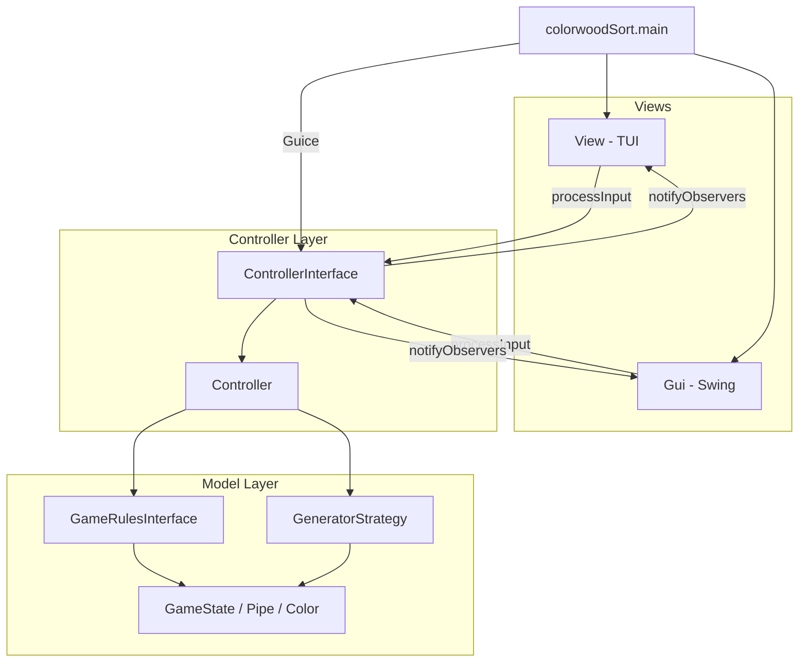

# ColorwoodSort

Ein **Colorwood-Sort**-Puzzle in **Scala 3** mit **MVC-Architektur**, mehreren GoF-Design-Patterns, **Google Guice** Dependency Injection, **ScalaTest** und **SonarQube**.

Das Spiel ist gleichzeitig über **TUI** (Terminal) und **GUI** (Swing) spielbar. Beide Views teilen sich einen gemeinsamen Controller und bleiben durch das **Observer Pattern** immer synchron.

---

## Inhaltsverzeichnis

- [Spielregeln](#spielregeln)
- [Architektur](#architektur)
- [Programmablauf](#programmablauf)
- [Design Patterns im Detail](#design-patterns-im-detail)
- [Code-Erklaerung nach Komponenten](#code-erklaerung-nach-komponenten)
- [Datenstrukturen](#datenstrukturen)
- [Eingabe und Steuerung](#eingabe-und-steuerung)
- [Paketstruktur](#paketstruktur)
- [Interfaces und Kapselung](#interfaces-und-kapselung)
- [Build und Ausfuehrung](#build-und-ausfuehrung)
- [Tests und Qualitaet](#tests-und-qualitaet)
- [Praesentation](#praesentation)

---

## Spielregeln

Colorwood Sort ist ein Sortier-Puzzle aehnlich wie „Water Sort Puzzle":

- Es gibt mehrere **Pipes** (Roere) mit fester **Kapazitaet** (Hoehe).
- Jede Pipe enthaelt farbige Bloecke (`Color`: R, G, Y, B, P).
- Es gibt immer **genau zwei leere Pipes** als Zielplaetze fuer das Sortieren.
- **Ziel:** Jede Pipe ist entweder **leer** oder enthaelt **nur Bloecke einer Farbe** und ist **voll**.

### Gueltige Zuege

Ein Zug von Pipe A nach Pipe B ist erlaubt, wenn:

1. Pipe A **nicht leer** ist.
2. Pipe B **noch Platz** hat.
3. Pipe B **leer** ist **oder** die oberste Farbe in B mit der oberste Farbe in A **uebereinstimmt**.

### Mehrere Bloecke auf einmal

Wenn mehrere Bloecke derselben Farbe uebereinander liegen, werden sie **als Gruppe** verschoben — aber nur so viele, wie in die Ziel-Pipe passen.

**Beispiel:** Pipe 1 hat von unten `[R, R, R]` und Pipe 2 hat noch 1 freien Platz → es wird nur **1** roter Block verschoben.

### Gewinnbedingung

Das Spiel ist geloest, wenn:

- mindestens eine Pipe Bloecke enthaelt, **und**
- jede Pipe entweder leer ist **oder** genau eine Farbe enthaelt und voll ist.

---

## Architektur

Die Anwendung folgt dem **Model–View–Controller (MVC)**-Pattern:

| Schicht | Aufgabe | Wichtige Typen |
|---------|---------|----------------|
| **Model** | Spieldaten, Regeln, Level-Generierung | `GameState`, `Pipe`, `Color`, `GameRulesInterface`, `GeneratorStrategy` |
| **View** | Ein-/Ausgabe fuer den Spieler | `View` (TUI), `Gui` (Swing) |
| **Controller** | Spielablauf, Eingabe, Undo/Redo | `ControllerInterface` → `Controller` |

### Wichtige Architektur-Regel

**Views greifen niemals direkt auf das Model zu.** Sie kennen nur das `ControllerInterface`. Der Controller delegiert Regeln und Zuege an `GameRulesInterface` und benachrichtigt die Views per `ControllerEvent`.



### Dependency Injection (Guice)

In `ColorwoodSortModule` werden Interfaces an konkrete Implementierungen gebunden:

| Interface | Implementierung | Grund |
|-----------|-----------------|-------|
| `ControllerInterface` | `Controller` (Singleton) | TUI und GUI muessen denselben Spielstand sehen |
| `GameRulesInterface` | `GameRules` | Regeln als austauschbare Komponente |
| `GeneratorStrategy` | `MediumGenerator` | Standard-Schwierigkeit |

Der Einstiegspunkt `colorwoodSort.main` erstellt den Guice-Injector und startet GUI und TUI. Es gibt **kein** `new Controller()` mehr in der Anwendung — Guice injiziert den Controller in beide Views.

---

## Programmablauf

### 1. Start (`colorwoodSort.main`)

```
main()
  → Guice.createInjector(ColorwoodSortModule)
  → injector.getInstance(Gui)      // GUI-Fenster oeffnet sich
  → injector.getInstance(View)       // TUI wird erstellt
  → tui.startGame(3, 4, List("R","G","Y"))
       → controller.startGame(...)
       → inputLoop()                 // TUI wartet auf Eingaben
```

Beim Start erzeugt der Controller ueber `GeneratorStrategy` einen gemischten `GameState` und benachrichtigt alle Observer mit `StateChanged`.

### 2. Ein Spielzug (TUI: `"2 4"` / GUI: Klick auf Pipe 2, dann Pipe 4)

```
View/GUI: controller.processInput("1 3")
  → Controller.workflowState.handleInput(...)     // State Pattern
  → PlayingState ruft controller.executeMove(...)
  → Parser.parseMove("1 3") → Some((0, 2))        // 1-basiert → 0-basiert
  → UndoManager.doStep(state, MoveCommand(...))   // Command Pattern
  → MoveCommand.doStep → GameRules.move(...)
  → bei Erfolg: gameState aktualisieren
  → notifyObservers(StateChanged(newState))
  → View/GUI.update(...) zeigt neuen Stand
  → GameRules.isSolved? → Message + FinishedState
```

### 3. Undo / Redo

```
"u" oder Undo-Button
  → UndoManager.undoStep(gameState)
  → MoveCommand.undoStep → gibt alten GameState zurueck
  → notifyObservers(StateChanged(...))

"r" oder Redo-Button
  → UndoManager.redoStep(gameState)
  → MoveCommand.redoStep → fuehrt Zug erneut aus
```

Der `UndoManager` speichert gueltige Zuege auf einem **Undo-Stapel**. Bei Undo wandert der Command auf den **Redo-Stapel**. Ein neuer Zug loescht die Redo-Historie.

### 4. Spielende

Wenn der Spieler `q` eingibt oder das Puzzle loest, wechselt der Controller in `FinishedState`. Weitere Eingaben erhalten die Meldung *"Game is finished. Please restart."*

---

## Design Patterns im Detail

### MVC (Model–View–Controller)

- **Model** kennt weder TUI noch GUI.
- **Views** kennen nur `ControllerInterface`.
- **Controller** verbindet beides und kapselt Undo, Parser und State Pattern.

### Observer Pattern

```scala
// Controller erbt von Observable[ControllerEvent]
controller.add(this)                    // View registriert sich
controller.notifyObservers(event)       // Controller informiert alle Views

// View reagiert:
override def update(event: ControllerEvent): Unit = event match {
  case StateChanged(state) => // Anzeige aktualisieren
  case Message(text)       => // Meldung ausgeben
}
```

**Warum wichtig:** TUI und GUI zeigen immer denselben Stand, ohne dass sie sich gegenseitig kennen.

### Strategy Pattern

```scala
trait GeneratorStrategy {
  def generate(pipeCount: Int, pipeHeight: Int, colors: List[Color]): GameState
}

// Easy: 10 Shuffle-Schritte, Medium: 30, Hard: 80
case object MediumGenerator extends GeneratorStrategy { ... }
```

**Warum wichtig:** Schwierigkeit ist zur Laufzeit austauschbar, ohne den Generator-Algorithmus im Controller zu aendern.

### Command Pattern

```scala
case class MoveCommand(from, to, before, rules) extends Command[GameState] {
  def doStep(state)  = rules.move(state, from, to)
  def undoStep(state) = before
  def redoStep(state) = rules.move(state, from, to)
}
```

**Warum wichtig:** Jeder Zug ist ein Objekt mit `do`/`undo`/`redo`. Der `UndoManager` kann beliebige Commands verwalten, ohne Move-Logik zu duplizieren.

### State Pattern

```scala
sealed trait ControllerState {
  def handleInput(input: String, controller: Controller): Unit
}

case object PlayingState  extends ControllerState { ... }  // Zuege, Undo, Quit
case object FinishedState extends ControllerState { ... }  // nur Hinweis
```

**Warum wichtig:** Eingabe-Logik haengt vom Spielzustand ab, ohne lange `if/else`-Ketten im Controller.

---

## Code-Erklaerung nach Komponenten

### Model

#### `GameElements.scala` — Kern-Daten

| Typ | Bedeutung |
|-----|-----------|
| `Color` | Enum: R, G, Y, B, P |
| `Pipe` | Kapazitaet + Liste der Bloecke (unten → oben) |
| `GameState` | Vektor aller Pipes |

Extensions liefern Hilfsmethoden: `isFull`, `topColor`, `pipeHeight`, `allShuffleMoves` (fuer den Generator).

#### `GameRules.scala` — Regeln (intern gekapselt)

Die Funktionen `isValid`, `move` und `isSolved` sind `private[model]`. Von aussen ist nur `GameRulesInterface` / `GameRules` sichtbar.

- **`isValid(from, to)`** — prueft Quell-Pipe nicht leer, Ziel hat Platz, Farben passen.
- **`move(state, from, to)`** — fuehrt gueltigen Zug aus; bei ungueltigem Zug wird der alte State zurueckgegeben.
- **`isSolved(state)`** — prueft Gewinnbedingung.

#### `Generator.scala` + `GeneratorStrategy.scala` — Level-Erzeugung

Ablauf des Generators:

1. Startzustand: fuer jede Farbe eine volle Pipe + 2 leere Pipes.
2. `count` mal einen zufaelligen gueltigen Shuffle-Zug ausfuehren.
3. Bevorzugt Zuege, die **nicht** sofort rueckgaengig gemacht werden (kein Hin- und Her).
4. Bevorzugt Zuege, die **mindestens so viele gemischte Pipes** erzeugen wie der aktuelle Stand.
5. Am Ende: **genau 2 Pipes leeren** (`forceEmptyTwoPipes`) und leere Pipes ans Ende sortieren.

| Strategie | Shuffle-Schritte | Schwierigkeit |
|-----------|------------------|---------------|
| `EasyGenerator` | 10 | leicht |
| `MediumGenerator` | 30 | mittel (Standard) |
| `HardGenerator` | 80 | schwer |

### Controller

#### `ControllerInterface.scala` — Oeffentliche API

Alles, was Views duerfen:

- `gameState` lesen
- `startGame(...)`, `processInput(...)`
- `undo()`, `redo()`, `canUndo`, `canRedo`
- `isFinished`
- Observer registrieren (`add`/`remove` via `Observable`)

#### `Controller.scala` — Implementierung

Enthaelt:

- `workflowState` — aktueller State (`PlayingState` / `FinishedState`)
- `gameState` — aktueller Spielstand
- `undoManager` — verwaltet Undo/Redo-Stapel
- `executeMove` — parst Eingabe, erstellt `MoveCommand`, fuehrt ihn aus

#### `Parser.scala` — Eingabe-Verarbeitung

- `parseMove("2 4", pipeCount)` — wandelt `"2 4"` in `(1, 3)` um (1-basierte Nutzereingabe → 0-basierte Indizes). Nutzt `Try` fuer sichere Integer-Konvertierung.
- `parseColor("R")` — wandelt Strings in `Color`-Enum.

#### `ControllerEvent.scala` — Observer-Nachrichten

```scala
enum ControllerEvent {
  case StateChanged(state: GameState)   // neuer Spielstand
  case Message(text: String)            // Info/Fehler/Gewinn
}
```

### View (Aview)

#### `View.scala` — Terminal-UI

- Registriert sich als `Observer[ControllerEvent]`.
- `startGame` startet das Spiel und ruft `inputLoop()` auf.
- Liest Zeile fuer Zeile von `StdIn` und leitet an `controller.processInput` weiter.
- `printGameState` rendert den Stand als ASCII-Gitter.

#### `Gui.scala` — Swing-GUI

- Ebenfalls `Observer[ControllerEvent]`.
- Zeichnet Pipes im Holz-Look mit `Graphics2D`.
- Bedienung per Mausklick: erst Quell-Pipe, dann Ziel-Pipe → erzeugt `"from to"` fuer den Controller.
- Buttons fuer Undo, Redo, New Game.
- Gewinn-Overlay mit „Noch eine Runde"-Button.

**Wichtig:** GUI und TUI senden **dieselben** Input-Strings an den Controller — die Spiellogik ist komplett view-unabhaengig.

### Util

#### `UndoManager.scala`

Generischer Manager fuer `Command[T]`:

- `doStep` — fuehrt Command aus; bei Aenderung auf Undo-Stapel legen, Redo leeren
- `undoStep` / `redoStep` — Stapel-Verwaltung
- `clear` — bei neuem Spiel Stapel leeren

---

## Datenstrukturen

### Pipe

```scala
case class Pipe(capacity: Int = 1, content: List[Color] = Nil)
```

- `content.head` = unterster Block, `content.last` = oberster Block
- `capacity` = maximale Anzahl Bloecke

### GameState

```scala
case class GameState(pipes: Vector[Pipe])
```

Unveraenderlich (immutable): Jeder Zug erzeugt einen **neuen** `GameState`. Das vereinfacht Undo (alter State wird gespeichert) und verhindert Seiteneffekte.

### Farben

```scala
enum Color:
  case R, G, Y, B, P
```

In der GUI werden die Enum-Werte auf AWT-Farben gemappt (Rot, Gruen, Gelb, Blau, Lila).

---

## Eingabe und Steuerung

### TUI-Befehle

| Eingabe | Aktion |
|---------|--------|
| `2 4` | Block(s) von Pipe 2 nach Pipe 4 verschieben (1-basiert) |
| `u` oder `undo` | Letzten Zug rueckgaengig |
| `r` oder `redo` | Letzten Undo wiederherstellen |
| `q` | Spiel beenden |

### GUI-Bedienung

1. Auf **Quell-Pipe** klicken (wird hervorgehoben)
2. Auf **Ziel-Pipe** klicken
3. **Undo / Redo / New Game** ueber Buttons

---

## Paketstruktur

```
de.htwg.se.colorwoodSort
├── ColorwoodSort.scala          # main-Methode, Programmstart
├── ColorwoodSortModule.scala    # Guice-Bindings
├── Aview/
│   ├── View.scala               # Terminal-UI (Observer)
│   └── Gui.scala                # Swing-GUI (Observer)
├── controller/
│   ├── ControllerInterface.scala  # Oeffentliche Controller-API
│   ├── Controller.scala           # Implementierung + State Pattern
│   ├── ControllerEvent.scala      # Observer-Events
│   ├── MoveCommand.scala          # Command fuer einen Zug
│   └── Parser.scala               # Eingabe-Parsing
├── model/
│   ├── GameElements.scala       # Color, Pipe, GameState
│   ├── GameRulesInterface.scala # Regel-Interface + GameRules-Fassade
│   ├── GameRules.scala          # isValid, move, isSolved (gekapselt)
│   ├── GeneratorStrategy.scala  # Strategy Pattern (Easy/Medium/Hard)
│   └── Generator.scala          # Shuffle-Algorithmus (gekapselt)
└── util/
    ├── Observable.scala         # Subject im Observer Pattern
    ├── Observer.scala           # Listener im Observer Pattern
    ├── Command.scala            # Command-Interface
    └── UndoManager.scala        # Undo/Redo-Verwaltung
```

---

## Interfaces und Kapselung

Alle Komponenten-Grenzen sind als **Traits mit ScalaDoc** (JavaDoc-Aequivalent) dokumentiert:

| Interface | Paket | Beschreibung |
|-----------|-------|--------------|
| `ControllerInterface` | controller | API fuer Views: Spielsteuerung, Undo/Redo, Observer |
| `GameRulesInterface` | model | Zugpruefung, Ausfuehrung, Gewinnerkennung |
| `GeneratorStrategy` | model | Level-Generierung mit konfigurierbarer Schwierigkeit |
| `Command[T]` | util | Ausfuehrbare, rueckgaengig machbare Aktionen |
| `Observable[T]` | util | Subject im Observer Pattern |
| `Observer[T]` | util | Listener im Observer Pattern |

Interne Implementierungsdetails (`GameRules`, `Generator`, `Parser`) sind mit `private[model]` bzw. `private[controller]` gekapselt. Views und Main kennen nur die Interfaces.

API-Dokumentation erzeugen:

```bash
sbt doc
```

Ausgabe: `target/scala-3.8.2/api/`

---

## Build und Ausfuehrung

Kompilieren:

```bash
sbt compile
```

Starten (TUI + GUI):

```bash
sbt run
```

Scala REPL:

```bash
sbt console
```

### Docker

```bash
./docker-run.sh
```

Manuell:

```bash
docker build -t colorwoodsort .
docker run -it --rm -e DISPLAY=$DISPLAY -v /tmp/.X11-unix:/tmp/.X11-unix colorwoodsort
```

---

## Tests und Qualitaet

[](https://coveralls.io/github/R0bi2/ColorwoodSort?branch=main)

Tests mit Coverage:

```bash
sbt clean test coverageReport
```

| Tool | Zweck |
|------|-------|
| **ScalaTest** | Unit-Tests fuer Model, Controller, Parser |
| **Scoverage** | Code-Coverage-Berichte |
| **SonarQube** | Statische Code-Analyse |
| **JDepend** | Paket-Abhaengigkeits-Metriken |
| **Graphviz** | Visualisierung von Abhaengigkeitsgraphen |

SonarQube:

```bash
sonar-scanner
```

JDepend:

```bash
java -cp jdepend-2.10.jar jdepend.textui.JDepend target/scala-3.8.2/classes
```

---

## Praesentation

Praesentationsfolien: **[Link hier eintragen nach dem Upload]**

> Nach dem Erstellen der Folien den Link oben eintragen (z. B. Google Slides, PDF im Repo).

---

## SBT-Befehle

| Befehl | Beschreibung |
|--------|--------------|
| `clean` | Loescht generierte Dateien in `target/` |
| `compile` | Kompiliert den Quellcode |
| `test` | Kompiliert und fuehrt alle Tests aus |
| `console` | Startet Scala REPL mit Projektklasspath |
| `run` | Startet die main-Methode |
| `package` | Erstellt JAR mit Klassen und Ressourcen |
| `doc` | Erzeugt ScalaDoc fuer die oeffentliche API |
